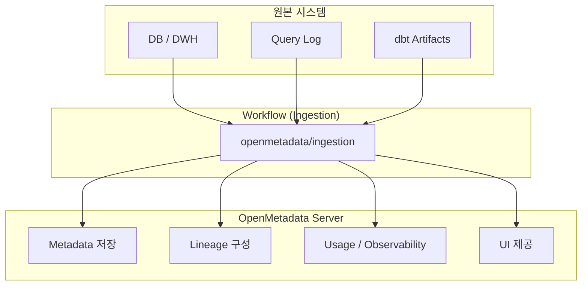

https://docs.open-metadata.org
읽어보면서 이해한 내용

## 🌟 OpenMetadata로 무엇을 할 수 있는가

- 데이터 검색 (Discovery)
- 데이터 관측성 (Observability)
- 데이터 거버넌스

---

## Quick Start
> https://docs.open-metadata.org/latest/quick-start

OpenMetaData 서버 + 메타데이터 저장소 + Workflow(Airflow 기반)가 각각 Pod로 실행된다.
(Airflow는 필수 구성요소는 아니지만 개념 이해를 위해 함께 실행하더라)

1. openmetadata-dependencies-web-*
   - 역할: OpenMetadata UI + API 서버
  
2. mysql-0
   - 역할: OpenMetadata 메타데이터 영구 저장소 (Metadata Store)
   - 무엇이 저장되나
     - 데이터 Entity 정보
     - 테이블/컬럼 정의
     - 태그, 용어사전
     - Lineage 메타 데이터
     - Ingestion 설정 자체

3. Opensearch-0
   - 역할: 검색엔진
  
4. openmetadata-dependencies-scheduler-*
   - 역할: Ingestion 스케줄러 (Airflow Scheduler)
     언제 실행할지, 실패 재시도를 관리

5. openmetadata-dependencies-triggerer-*
   - 역할: 이벤트 기반 실행 담당 (Airflow Triggerer)

6. openmetadata-dependencies-sync-users-*
   - 역할: 사용자/권한 동기화 작업

---

## metadata는 어떻게 수집되나요?

OpenMetadata에서 메타데이터 수집(Ingestion)은 다음 3가지 요소의 조합으로 동작
> Connector + 워크플로우(Workflow) + 스케줄러

- Connector
원본 시스템(DB, DWH, BI, dbt, 로그 등)에 접속해 메타데이터를 읽는 로직

- Workflow (Ingestion Pipeline)
커넥터를 실행해 메타데이터를 수집·가공하고 OpenMetadata로 전달하는 실행 단위
> **중요** OpenMetadata Server가 직접 수집하지 않고,Workflow가 별도로 실행된다.

- Scheduler
Workflow를 언제 실행할지 결정

### Workflow 작업 이해하기
- 1. openmetadata/ingestion Docker 이미지 기반의 Job/Pod 실행
- 2. 이미지 내부에 이미 포함된 Connector 코드 로딩
- 3. 설정된 원본 소스(DB, DWH, BI 등)에 직접 연결
- 4. 메타데이터 수집 및 표준 포맷으로 변환
- 5. OpenMetadata Server API로 결과 전송

> 커넥터를 따로 설치하거나 배포할 필요 없음.

### Workflow의 주요 유형
OpenMetadata에서는 목적에 따라 여러 종류의 Workflow를 제공

1. Metadata Ingestion Workflow : 메타데이터 수집
2. Usage (Query Log) Workflow : 사용 메타데이터 수집
3. Lineage Workflow : 데이터 흐름 수집
4. Data Profiler Workflow : 데이터 품질 관측
5. dbt Workflow
